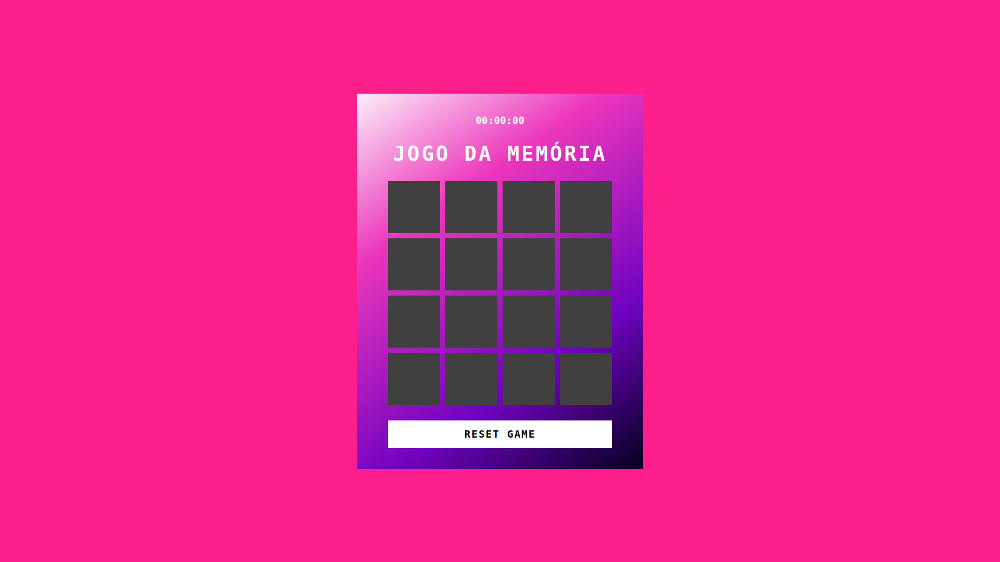
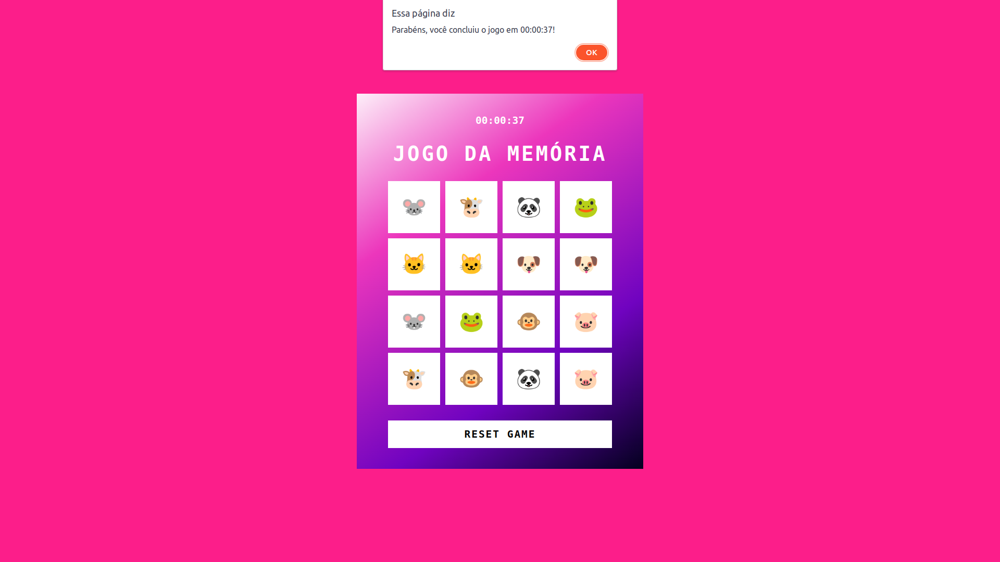

# memory-game
> Desafio DIO - Criando um Jogo da memória com Emojis Utilizando Javascript

## 📋 Índice

- [📖 Sobre](#-Sobre)
- [🚀 Tecnologias utilizadas](#-Tecnologias-utilizadas)
- [🖥 Preview](#-Preview)

## 📖 Sobre
Projeto desenvolvido durante o Bootcamp [Potência Tech iFood - Desenvolvimento de Jogos](https://web.dio.me/track/potencia-tech-ifood-desenvolvimento-de-jogos) com o professor [Felipe Aguiar](https://github.com/felipeAguiarCode).

## 🚀 Tecnologias utilizadas

## 🖥 Preview:

  
   
  

